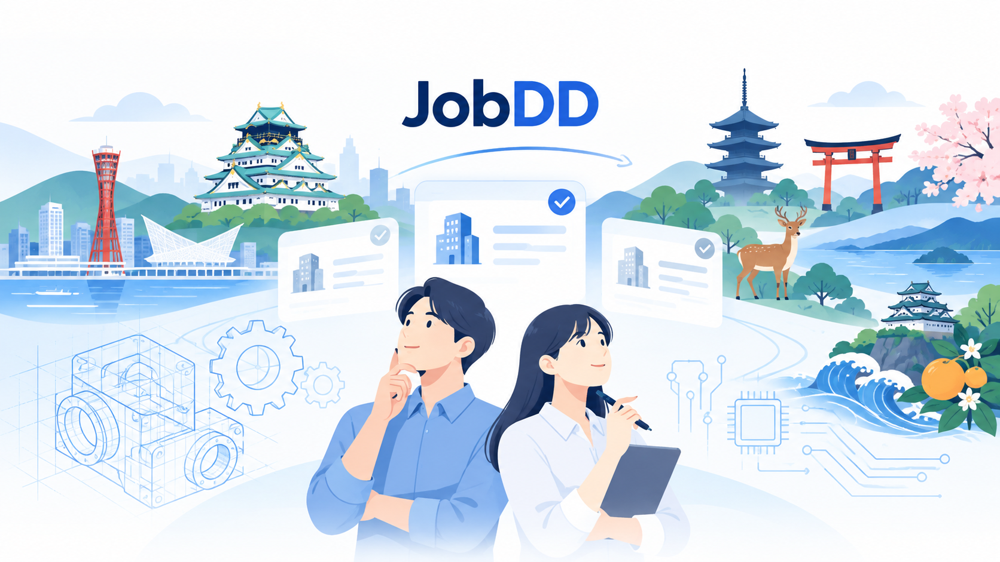

# JobDD

> **「根拠とともに、仕事を選ぶ。」**  
> 求人を探すだけでは分からない「仕事の中身」を構造化し、根拠とともに比較して、自分で選べるようにする Decision Support サービスです。



## Links

- **Product:** https://jobdd.jp/
- **GitHub:** https://github.com/totti80/jobdd
- **Submission tag:** `graduation-submit-ready-v2`

> 審査用ログイン情報は、セキュリティ上の理由から README / GitHub には記載していません。  
> 提出フォームの指定欄にのみ記載しています。

---

## Why me

私は30年以上、発電プラントをはじめとする機械設計の仕事に携わってきました。

技術職の求人を見ていると、同じ「機械設計」「電気設計」という職種名でも、実際には、

- 何を設計するのか
- どの工程を担当するのか
- どのCAD / Toolを使うのか
- 顧客・製造・現場とどう関わるのか
- 入社後、最初にどんな仕事を任されるのか

といった「仕事の中身」が大きく異なります。

また、過去に勤務先で人材紹介の新規事業を検討した経験があり、人材領域の課題を自分の仕事として考えてきました。

その経験から、

> **求人の数を増やすだけではなく、求職者が仕事内容を理解し、比較し、自分で判断できる状態をつくりたい**

と考え、JobDDを卒業制作として開発しました。

---

## Who

### 求職者

卒業制作MVPでは、主に

**近畿6府県 × 機械設計・電気設計**

の求職者を対象にしています。

想定している課題は、

- 求人票だけでは実際の仕事内容が分かりにくい
- 同じ職種名でも仕事内容が大きく違う
- 複数求人を同じ軸で比較しにくい
- 情報が書かれていないことと、自分に合わないことを区別しにくい

といったものです。

### 企業

機械設計・電気設計人材を採用する企業に対しては、

- 通常の求人票では仕事の中身を十分に伝えにくい
- 求職者へ、より具体的な仕事内容を伝えたい

という課題仮説を検証していきます。

JobDDは企業向けCMSを作ること自体が目的ではありません。

**企業が入力した仕事内容を、求職者の意思決定に使える構造へ変換すること**を目的としています。

---

## What

JobDDは、求人情報を

**Find するためのサービスではなく、Understand / Compare / Decide するためのサービス**

として設計しています。

基本思想は、

> **Recommend ではなく Decision Support**

です。

AIやシステムが転職先を決めるのではなく、

- 情報整理
- 構造化
- 比較
- 希望条件との照合
- 適合理由・相違点の説明
- 未確認事項の明示
- Evidence / Source の提示
- 応募経路の整理

までを支援し、最終判断は求職者本人が行います。

---

## Problem / Solution

人材領域のインタビューでは、

- 「求職者が集まらない」
- 「集まった求職者と求人のマッチ度が低い」

というPainが確認されています。

JobDDでは、その背景にある一つの要因として、

**求職者が応募前に仕事の中身を十分理解できていない可能性**

に着目しています。

そこで、

```text
企業が仕事内容を構造化して入力
        ↓
JobDDが比較可能な情報へ変換
        ↓
求職者が求人を同じ軸で理解・比較
        ↓
Evidenceを確認
        ↓
応募方法を確認
        ↓
求職者本人が判断
```

という体験を実装しました。

---

## Main Features

### 1. 求職者向け

- かんたん希望条件入力
- 必要な人だけ詳細条件を追加する Progressive Disclosure
- 求人一覧
- Job Fit表示
  - `MATCH`
  - `MISMATCH`
  - `UNKNOWN`
- 求人詳細 / Decision View
- 最大3件の求人比較
- Evidence / Source / Provenance確認
- Application Route確認
- 20件単位ページネーション
- モバイル対応

### 2. 企業向け

- Self-service企業登録
- Company Dashboard
- 求人Draft作成
- **Level 1 Basic**
- **Level 2 Structured Job Profile**
- Preview
- 公開申請
- 修正依頼対応
- 公開停止 / 再開
- Account Settings

### 3. Controlled Publish

企業が入力した求人は即時公開されません。

```text
Draft
  ↓
Preview
  ↓
公開申請
  ↓
Platform Owner / Admin Review
  ↓
承認 / 修正依頼
  ↓
Publish
```

承認済みの内容だけを求職者側へ公開します。

公開済み求人を企業が編集している間も、求職者には**最後に承認されたPublished Snapshot**を表示し続けます。

---

## Level 1 / Level 2

### Level 1 Basic

求人を公開するための最低限情報です。

主な項目：

- 求人タイトル
- 職種
- 勤務地
- 年収
- 雇用形態
- 仕事内容
- 最低限の応募条件
- 応募URL

**Level 1の公開必須項目が揃えば公開申請できます。**

### Level 2 Structured Job Profile

JobDDらしい「仕事の中身」を伝えるための追加情報です。

例：

- 設計対象
- 担当工程
- 入社直後の担当
- CAD / Tool
- Toolの使用場面
- 応募時の経験要件
- 一緒に働く相手
- 顧客との関係
- 製造・現場との関係
- 仕事の進め方
- 仕事の難しさ
- Typical Day
- Representative Project

卒業制作MVPでは **Level 2は全項目Optional** です。

未入力でも公開可能ですが、入力された情報は求職者側のDecision View / Compareへ反映されます。

---

## Information Design

JobDDでは、以下を分けて扱います。

```text
Publication Requirement
= 求人を公開できるか

Information Completeness
= 仕事の中身をどれだけ詳しく伝えられているか

Feature Entitlement
= 将来、契約プラン上その機能を使えるか
```

将来有料化する場合も、公開条件と課金条件を混在させない方針です。

また、

> **Paid Information Depth ≠ Paid Ranking**

を原則とし、課金によって求職者向けFit / Comparison / Rankingを有利にしません。

---

## Architecture

```text
Supply Side
    ↓
Company Authoring
    ↓
Controlled Publish
    ↓
Published Snapshot
    ↓
Decision Support Core
    ├─ Job Fact
    ├─ Context Role
    ├─ Evidence
    ├─ Source
    ├─ Provenance
    ├─ Job Fit
    └─ Application Route
    ↓
Demand Side
    ↓
Understand / Compare / Decide
```

### Authoring Model と Published Model の分離

企業が編集中の内容と、求職者へ公開する内容を分離しています。

```text
Authoring Model
= 企業が編集中の最新状態

Published Snapshot
= 最後に承認・Publishされた公開内容
```

これにより、企業が求人を更新している途中でも、未承認情報が求職者側へ出ないようにしています。

---

## Technology

- **Backend:** PHP / Laravel 13
- **Database:** MySQL
- **Frontend:** Blade / HTML / Tailwind CSS / JavaScript
- **Crawler / Data Processing:** Python
- **Build:** Vite / npm
- **Version Control:** Git / GitHub
- **Production:** Sakura Rental Server
- **Domain:** https://jobdd.jp/

---

## Quality / Testing

卒業制作提出版では、以下を確認しています。

- Automated Tests: **1,060 PASS / 8,059 assertions**
- 公開要件テスト: 48 PASS
- PC表示確認
- 390px mobile表示確認
- Pint PASS
- `npm run build` PASS
- `git diff --check` PASS
- Production Smoke Test PASS
- Published Snapshot回帰確認
- Job Facts回帰確認
- Seeker Decision View回帰確認
- Compare回帰確認
- paused lifecycle回帰確認

本番環境でも、

- Level 1のみで公開申請
- Level 2未入力で公開申請
- Tool / Typical Dayの部分入力Validation
- Company Dashboard各Lifecycle
- Controlled Publish
- 公開済み内容を維持した修正依頼
- 求人検索 / 詳細 / 比較

を確認しています。

---

## Demo / Graduation Review

卒業制作審査用データは、通常のCompany / Job Lifecycleを利用しています。

Demo専用の、

- 特殊Account Type
- `is_demo` フラグ
- Demo専用Publish Validator
- Demo専用権限

等は追加していません。

原則は、

> **データはDemo、システム挙動は通常**

です。

審査用ログイン情報は、**GitHubには掲載していません**。  
提出フォームの指定欄を確認してください。

---

## Security / Public Repository

このリポジトリには、

- `.env`
- API Key
- DB password
- private key
- 本番DB dump
- 審査用ID / password

を含めていません。

`.env.example` には環境変数名のみを記載しています。

---

## Local Setup

一例です。環境に合わせてLaravel / MySQL / Node.jsを用意してください。

```bash
git clone https://github.com/totti80/jobdd.git
cd jobdd

cp .env.example .env

composer install
npm install

php artisan key:generate

# .env のDB設定後
php artisan migrate

npm run build
php artisan serve
```

開発時はLaravel Sail / Docker環境も利用できます。

---

## Repository / Submission

卒業制作提出版はGit tagで固定しています。

```text
graduation-submit-ready-v2
```

過去の復帰点として、

```text
graduation-submit-ready-v1
legacy-jobdd-submit-ready
```

も保持しています。

---

## What I Learned

卒業制作では、

**「人と会社の、より良い出会いを作る」**

ことをテーマに開発しました。

制作途中では、技術的には取得可能な求人情報でも、利用規約・再利用条件等の観点からそのまま事業利用できないことが分かり、データ供給モデルを大きく見直しました。

その結果、

**第三者データを大量に集めること**

よりも、

**企業自身から情報を受け取り、仕事の中身を比較可能な情報へ変換すること**

へ重点を移しました。

自分の考えをコードとして形にする楽しさと、仮説や前提が崩れたときに設計を変える難しさの両方を経験できた卒業制作でした。

---

## Next

卒業制作で完成ではなく、ここから検証を進めます。

特に確認したいのは、

### 求職者

> 機械設計・電気設計の求職者は、通常の求人票だけでは分からない仕事の中身を、応募前に理解・比較したいのか？

### 企業

> 機械設計・電気設計人材を採用する企業は、通常の求人票では仕事内容を十分に伝えにくいというPainを持っているのか？

### Structured Job Profile

> JobDDのLevel 2情報は、企業側の仕事内容の言語化と、求職者側の求人理解・比較に本当に役立つのか？

ユーザーインタビュー・実利用を通じて、今後も検証・改善していきます。
